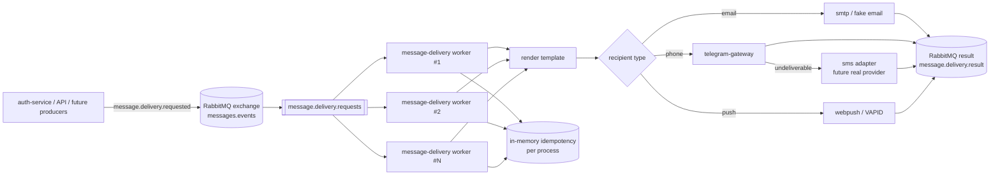

# message-delivery

Generic message delivery worker for email, phone and browser Web Push messages.

The service consumes `message.delivery.requested` events, renders templates, chooses a provider plan, sends the message through a provider adapter, and publishes `message.delivery.result`.

It is intentionally not tied to any product domain. Producers such as `auth-service` and application APIs should publish the same generic delivery contract with different templates and variables.

## Features

- RabbitMQ consumer and result publisher
- Generic delivery request/result event contract
- Email, phone and browser Web Push recipient types
- Provider fallback chain
- User-selected provider support
- In-memory idempotency for local/test runs
- Template rendering with locale fallback
- File-based HTML email templates with text fallback
- Reusable `chat_message_notification` HTML template for chat delivery
- Fake providers for local and integration tests
- Health endpoint
- Makefile, systemd unit, Dockerfile, `.deb` packaging

## Architecture

`message-delivery` is a worker service, not a domain API. It does not know how users register, reset passwords, create orders or receive product notifications. Producers send generic delivery events, and this service only handles message rendering, provider choice, delivery and result reporting.

Main components:

| Component | Responsibility |
|---|---|
| `cmd/main.go` | Loads config, builds dependencies, starts health server and worker loop. |
| `internal/config` | Reads JSON config, applies env overrides, validates required broker/provider/template settings. |
| `internal/broker` | Owns RabbitMQ connection, exchange/queue/DLQ declaration, consuming request events and publishing result events. |
| `internal/worker` | Reads RabbitMQ deliveries, decodes requests, acknowledges successful handling and dead-letters invalid messages. |
| `internal/delivery` | Contains request/result contracts and the orchestration algorithm. |
| `internal/template` | Renders configured inline/file templates using event variables and locale fallback. |
| `internal/provider` | Defines provider interfaces, registry, fake/unavailable providers and concrete adapters. |
| `tests/integration` | Runs real RabbitMQ consume/publish flow in Docker Compose. |

Processing flow:

```text
producer
  -> RabbitMQ exchange messages.events
  -> routing key message.delivery.requested
  -> queue message.delivery.requests
  -> worker
  -> validate event
  -> render template
  -> choose provider plan
  -> send via provider adapter
  -> publish message.delivery.result
```

Scaled processing view:



Horizontal scaling is done by running more `message-delivery` instances against the same RabbitMQ queue. RabbitMQ distributes messages across consumers. Current idempotency is process-local, so a production deployment that scales workers should add a shared idempotency store before relying on exactly-once behavior across restarts or replicas.

Failure flow:

```text
invalid JSON / invalid contract
  -> message is rejected without requeue
  -> RabbitMQ routes it to message.delivery.requests.dlq

provider returns undeliverable
  -> orchestrator tries the next provider if fallback is enabled

provider returns failed
  -> orchestrator stops and publishes failed result

worker/orchestrator internal error
  -> message is nacked with requeue=true
```

Idempotency is currently in-memory and keyed by `event_id`. This is enough for local/test runs and protects against duplicate delivery while the process is alive. Production-grade idempotency should be moved to Redis/PostgreSQL before horizontal scaling.

Provider adapters are intentionally isolated behind:

```text
Send(ctx, message) -> Result
```

That keeps Telegram, WhatsApp, SMS, SMTP, SES, Mailgun or other providers replaceable without changing producer contracts. Auth codes and future notifications use the same delivery mechanism; only `template`, `purpose`, `recipient_type`, `recipient` and `variables` differ.

Configuration is split into:

- tracked JSON config for non-secret routing, templates and adapter shape;
- tracked `templates/` files for reusable HTML/text email layouts;
- env/runtime secrets for tokens, passwords and external credentials;
- env overrides for deployment-specific broker/port settings.

This repository contains the service artifact and local/test runtime. Kubernetes or production infrastructure manifests should live in a separate deploy repository.

For a systemd installation, `make install` creates the dedicated
`message-delivery` system user, installs the unit and reads deployment secrets
from the optional `/etc/message-delivery/message-delivery.env`. For example:

```dotenv
RABBITMQ_PASSWORD=replace-with-a-secret
SMTP_USERNAME=no-reply@example.com
SMTP_PASSWORD=replace-with-a-secret
```

The tracked JSON configuration must refer to those variables through
`PasswordEnv` and provider-specific `*Env` fields; credentials do not belong in
the repository or the JSON config.

### Chat message notification template

`chat_message_notification` is the implemented HTML email template for an
asynchronous copy of an incoming chat message. It requires `sender`, `message`
and `chat_id`; the last value is delivery metadata and is deliberately not
interpreted by this service.

```json
{
  "version": "1.0",
  "event_id": "chat-message-notification-42",
  "type": "message.delivery.requested",
  "source": "api.notifications",
  "template": "chat_message_notification",
  "purpose": "notification",
  "recipient_type": "email",
  "recipient": "user@example.com",
  "variables": {
    "sender": "Anna",
    "message": "Hello",
    "chat_id": "71"
  },
  "delivery": { "allow_fallback": true },
  "metadata": { "locale": "en" }
}
```

The configuration example ships English and Russian file templates in
`templates/email/chat_message_notification.*.html`. SMTP treats all variables as
untrusted HTML and escapes them before rendering.

## Event Contract

### Request

```json
{
  "version": "v1",
  "event_id": "uuid-or-random-id",
  "type": "message.delivery.requested",
  "source": "auth-service",
  "template": "auth_verification_code",
  "purpose": "verification",
  "recipient_type": "phone",
  "recipient": "+10000000000",
  "variables": {
    "code": "123456",
    "ttl_sec": "300"
  },
  "user_id": 123,
  "created_at": "2026-07-18T18:00:00Z",
  "delivery": {
    "selected_provider": "",
    "provider_chain": ["telegram", "sms"],
    "allow_fallback": true
  },
  "metadata": {
    "device_uid": "device-1",
    "locale": "en"
  }
}
```

### Result

```json
{
  "version": "v1",
  "event_id": "uuid",
  "type": "message.delivery.result",
  "request_event_id": "uuid-or-random-id",
  "status": "sent",
  "recipient_type": "phone",
  "recipient": "+10000000000",
  "provider": "sms",
  "attempt": 2,
  "created_at": "2026-07-18T18:00:01Z"
}
```

## Provider Policy

For phone recipients, the default provider chain is:

```text
telegram -> sms
```

If `delivery.selected_provider` is set and `allow_fallback=false`, only that provider is tried. If `allow_fallback=true`, the selected provider is tried first and the chain continues on `undeliverable`.

Implemented adapter kinds:

| Kind | Channel | Status |
|---|---|---|
| `fake` | email, phone | Implemented. Used for deterministic local/integration tests. |
| `smtp` | email | Implemented. Sends rendered text or HTML email through SMTP using `gomail`. |
| `telegram-gateway` | phone | Implemented. Sends Telegram Gateway verification messages. |
| `webpush` | push | Implemented. Encrypts a browser payload and signs it with VAPID. HTTP `404`/`410` means the subscription is no longer deliverable. |

The default example config uses fake providers for deterministic local tests:

- `fake-email` sends successfully.
- `telegram` returns `undeliverable`.
- `sms` sends successfully.

Not implemented yet:

- WhatsApp delivery adapter.
- Real SMS provider adapters such as Twilio.

Do not put `whatsapp`, `twilio` or another future provider into `AllowedProviders` until a matching adapter kind is implemented in `internal/provider/factory`.

## Template Behavior

Templates are a common input contract for producers, but not every provider can send arbitrary rendered text.

| Adapter kind | Uses rendered `subject` | Uses rendered `body` | Uses structured variables |
|---|---:|---:|---:|
| `smtp` | yes | yes | no |
| `fake` | yes | yes | no |
| `telegram-gateway` | no | no | yes |
| `webpush` | fallback | fallback | `push_*` metadata |

For `smtp` and future text-based providers, the service renders the configured template using `variables` and sends the rendered body.

For `telegram-gateway`, Telegram controls the verification message text. The adapter does not send our rendered `subject` or `body`. It uses the template only as a logical key and validation boundary, then maps structured event fields to Telegram Gateway:

| Event field | Telegram Gateway field |
|---|---|
| `recipient` | `phone_number` |
| `variables.code` | `code` |
| `variables.ttl_sec` | `ttl` |
| `event_id` | `payload` |
| `metadata.telegram_sender_username` | `sender_username` |
| `metadata.telegram_callback_url` | `callback_url` |

That means producers should still publish `template=auth_verification_code`, but they must not expect Telegram Gateway to display the configured template text. The code shown to the user is the value from `variables.code`, or a Telegram-generated code if a future adapter mode omits `code`.

For `webpush`, the renderer still validates the declared template. The final
browser payload is built from the following optional metadata, with rendered
`subject`/`body` used as fallbacks:

| Event metadata | Browser payload field |
|---|---|
| `push_p256dh` | subscription encryption public key, required |
| `push_auth` | subscription auth secret, required |
| `push_title` | notification title |
| `push_body` | notification body |
| `push_target_path` | same-origin path opened after click |
| `push_tag` | browser notification tag |

The service never derives a subscription from a user identifier. A producer
must persist the browser-created endpoint and keys and send one delivery event
per subscription. It should disable the subscription after `undeliverable`.

### Email HTML Templates

Email templates can be stored as files instead of long JSON strings. This is the preferred format for styled email.

The repository layout is:

```text
templates/
  email/
    auth_verification_code.en.html
    auth_verification_code.ru.html
    auth_password_reset.en.html
    auth_password_reset.ru.html
```

```json
{
  "Templates": {
    "DefaultLocale": "en",
    "BaseDir": "templates",
    "Items": {
      "auth_password_reset": {
        "Subject": {
          "en": "Password reset code",
          "ru": "Код сброса пароля"
        },
        "TextBody": {
          "en": "Your password reset code is {{code}}.",
          "ru": "Ваш код сброса пароля: {{code}}."
        },
        "HtmlBodyFile": {
          "en": "email/auth_password_reset.en.html",
          "ru": "email/auth_password_reset.ru.html"
        },
        "RequiredVariables": ["code", "ttl_sec"]
      }
    }
  }
}
```

Supported body fields, in priority order:

| Field | Description |
|---|---|
| `HtmlBody` | Inline HTML body from config. |
| `HtmlBodyFile` | HTML body loaded from a file under `Templates.BaseDir`. |
| `TextBody` | Inline text body from config. |
| `TextBodyFile` | Text body loaded from a file under `Templates.BaseDir`. |
| `Body` | Backward-compatible text body field. |

If `HtmlBody` or `HtmlBodyFile` is used and `ContentType` is not set, the renderer sends `text/html; charset=UTF-8`. Text templates default to `text/plain; charset=UTF-8`.

`Templates.BaseDir` can be relative. Relative paths are resolved against the config file location, so `/etc/message-delivery/config.json` with `BaseDir=templates` reads files from `/etc/message-delivery/templates`.

Deployment behavior:

| Runtime | Template location |
|---|---|
| Local `go run --config message-delivery.example.json` | `./templates` |
| Docker image | `/etc/message-delivery/templates` |
| `make install` | `/etc/message-delivery/templates` |
| `.deb` package | `/etc/message-delivery/templates` |

To add a new styled email:

1. Add one HTML file per locale under `templates/email/`.
2. Add `Subject`, `TextBody` and `HtmlBodyFile` to `Templates.Items`.
3. Keep `RequiredVariables` in sync with placeholders used by the HTML/text bodies.
4. Publish the same template key in `message.delivery.requested.template`.

Example request:

```json
{
  "template": "auth_password_reset",
  "recipient_type": "email",
  "recipient": "user@example.com",
  "variables": {
    "code": "112233",
    "ttl_sec": "300"
  },
  "metadata": {
    "locale": "ru"
  }
}
```

For this request, SMTP sends `templates/email/auth_password_reset.ru.html` as `text/html; charset=UTF-8`.

## Configuration

Copy and edit the example config:

```bash
cp message-delivery.example.json message-delivery.json
```

Secrets must come from environment variables or the runtime secret mechanism, not from tracked config.

Useful environment overrides:

| Variable | Description |
|---|---|
| `MESSAGE_DELIVERY_HOST` | HTTP bind host |
| `MESSAGE_DELIVERY_PORT` | HTTP health port |
| `MESSAGE_DELIVERY_BROKER_HOST` | RabbitMQ host, for example `127.0.0.1:5673` |
| `MESSAGE_DELIVERY_BROKER_USER` | RabbitMQ username |
| `MESSAGE_DELIVERY_BROKER_PASSWORD` | RabbitMQ password |
| `MESSAGE_DELIVERY_BROKER_PREFETCH` | Consumer prefetch count |
| `RABBITMQ_PASSWORD` | Password used when `Broker.PasswordEnv` points to it |
| `TELEGRAM_GATEWAY_API_TOKEN` | Telegram Gateway adapter token |
| `MESSAGE_DELIVERY_WEB_PUSH_VAPID_PUBLIC_KEY` | Public VAPID key for the `webpush` adapter |
| `MESSAGE_DELIVERY_WEB_PUSH_VAPID_PRIVATE_KEY` | Private VAPID key for the `webpush` adapter |
| `SMTP_USERNAME` | SMTP account username for the `smtp` email adapter |
| `SMTP_PASSWORD` | SMTP account password or app password for the `smtp` email adapter |
| `SMTP_FROM` | SMTP sender address |

For local tests, `message-delivery.example.json` uses fake phone providers. To send through Telegram Gateway, switch the `telegram` adapter:

```json
{
  "Enabled": true,
  "Kind": "telegram-gateway",
  "BaseURL": "https://gatewayapi.telegram.org",
  "ApiTokenEnv": "TELEGRAM_GATEWAY_API_TOKEN"
}
```

The token must be exported in the runtime environment, not committed to the config file.

For real SMTP delivery, use `message-delivery.smtp.example.json` or configure an adapter with:

```json
{
  "Enabled": true,
  "Kind": "smtp",
  "Host": "smtp.yandex.com",
  "Port": 465,
  "Security": "tls",
  "AuthHost": "smtp.yandex.com",
  "TimeoutSec": 20,
  "UsernameEnv": "SMTP_USERNAME",
  "PasswordEnv": "SMTP_PASSWORD",
  "FromEnv": "SMTP_FROM"
}
```

`Security` supports:

| Value | Behavior |
|---|---|
| `tls` | Open an implicit TLS SMTP connection, normally port `465`. |
| `starttls` | Open a plain SMTP connection and upgrade through STARTTLS, normally port `587`. |
| empty | Use implicit TLS on port `465`; otherwise use STARTTLS when the server advertises it. |

For Yandex Mail, the documented SMTP settings are `smtp.yandex.com`, SSL/TLS and port `465`. Port `587` can be used only when the client starts without encryption and upgrades with STARTTLS. Use an app password, not the account's primary password.

### Browser Web Push

Web Push uses a single VAPID key pair per deployment. Generate it once and
store the private value only in the deployment secret store:

```bash
go run ./cmd/generate-vapid
```

The command prints environment assignments. Put only the public value into the
producer configuration that tells browsers how to subscribe. Configure the
worker with the same pair:

```json
{
  "Providers": {
    "Push": {
      "Enabled": true,
      "DefaultProvider": "webpush",
      "AllowedProviders": ["webpush"],
      "Adapters": {
        "webpush": {
          "Enabled": true,
          "Kind": "webpush",
          "TimeoutSec": 10,
          "VAPIDPublicKeyEnv": "MESSAGE_DELIVERY_WEB_PUSH_VAPID_PUBLIC_KEY",
          "VAPIDPrivateKeyEnv": "MESSAGE_DELIVERY_WEB_PUSH_VAPID_PRIVATE_KEY",
          "VAPIDSubscriber": "mailto:notifications@example.com"
        }
      }
    }
  }
}
```

The browser must be served over HTTPS and must register a service worker before
creating a subscription. The producer should send `recipient_type: "push"`,
the browser endpoint in `recipient`, and the subscription keys in the metadata
table above. A `404` or `410` response disables that subscription; a temporary
`429` or `5xx` response is reported as `failed` for the producer retry policy.

## Usage

`message-delivery` has no public send HTTP API. Producers use RabbitMQ:

1. Publish a `message.delivery.requested` JSON event to the configured exchange.
2. Use routing key `message.delivery.requested`.
3. Read `message.delivery.result` events from a queue bound to routing key `message.delivery.result`.
4. Match the result with the original request by `request_event_id`.

Default broker settings from `message-delivery.example.json`:

| Setting | Value |
|---|---|
| Exchange | `messages.events` |
| Exchange type | `topic` |
| Request routing key | `message.delivery.requested` |
| Result routing key | `message.delivery.result` |
| Consumer queue | `message.delivery.requests` |
| Dead-letter queue | `message.delivery.requests.dlq` |

### Start with Isolated RabbitMQ

For a fully local smoke test:

```bash
docker compose -f docker-compose.integration.yml up --build rabbitmq message-delivery
```

RabbitMQ management UI is exposed on:

```text
http://localhost:15674
```

Default credentials in the integration compose are `guest` / `guest`.

### Publish a Phone Verification Code

Use the manual client instead of RabbitMQ UI:

```bash
go run ./cmd/send-test-message \
  --config message-delivery.example.json \
  --recipient-type phone \
  --recipient +15551234567 \
  --template auth_verification_code \
  --purpose registration_verification \
  --code 123456 \
  --ttl-sec 300 \
  --provider-chain telegram,sms \
  --allow-fallback=true \
  --wait-result=true
```

The command publishes `message.delivery.requested`, waits for the matching `message.delivery.result`, and prints the result JSON.

Example request for phone verification:

```json
{
  "version": "v1",
  "event_id": "manual-phone-1",
  "type": "message.delivery.requested",
  "source": "auth-service",
  "template": "auth_verification_code",
  "purpose": "registration_verification",
  "recipient_type": "phone",
  "recipient": "+15551234567",
  "variables": {
    "code": "123456",
    "ttl_sec": "300"
  },
  "user_id": 123,
  "created_at": "2026-07-18T18:00:00Z",
  "delivery": {
    "selected_provider": "",
    "provider_chain": ["telegram", "sms"],
    "allow_fallback": true
  },
  "metadata": {
    "locale": "en",
    "device_uid": "device-1"
  }
}
```

Publish it with `rabbitmqadmin` against the integration RabbitMQ:

```bash
rabbitmqadmin \
  --host localhost \
  --port 15674 \
  --username guest \
  --password guest \
  publish \
  exchange=messages.events \
  routing_key=message.delivery.requested \
  payload='{"version":"v1","event_id":"manual-phone-1","type":"message.delivery.requested","source":"auth-service","template":"auth_verification_code","purpose":"registration_verification","recipient_type":"phone","recipient":"+15551234567","variables":{"code":"123456","ttl_sec":"300"},"user_id":123,"created_at":"2026-07-18T18:00:00Z","delivery":{"selected_provider":"","provider_chain":["telegram","sms"],"allow_fallback":true},"metadata":{"locale":"en","device_uid":"device-1"}}' \
  properties='{"content_type":"application/json","delivery_mode":2}'
```

With the default example config this uses fake providers: Telegram returns `undeliverable`, then SMS returns `sent`.

After `make build`, the same command is available as:

```bash
bin/message-delivery-send \
  --config message-delivery.example.json \
  --recipient-type phone \
  --recipient +15551234567 \
  --code 123456
```

This default example does not send a real Telegram message. It is a local smoke test for RabbitMQ wiring and orchestration.

### Send a Real Telegram Gateway Code

Use `message-delivery.telegram.example.json` when you want real Telegram Gateway delivery through the full service path.

Start RabbitMQ:

```bash
docker compose -f docker-compose.integration.yml up -d rabbitmq
```

Start `message-delivery` with the Telegram Gateway config:

```bash
export RABBITMQ_PASSWORD=guest
export MESSAGE_DELIVERY_BROKER_HOST=127.0.0.1:5674
export TELEGRAM_GATEWAY_API_TOKEN=...

go run ./cmd/main.go --config message-delivery.telegram.example.json
```

In another terminal, publish a real Telegram request through the manual client:

```bash
export RABBITMQ_PASSWORD=guest
export MESSAGE_DELIVERY_BROKER_HOST=127.0.0.1:5674

go run ./cmd/send-test-message \
  --config message-delivery.telegram.example.json \
  --recipient-type phone \
  --recipient +15551234567 \
  --event-id manual-telegram-live-1 \
  --code 123456 \
  --provider telegram \
  --allow-fallback=false \
  --wait-result=true \
  --timeout=20s
```

Expected result:

```json
{
  "type": "message.delivery.result",
  "request_event_id": "manual-telegram-live-1",
  "status": "sent",
  "recipient_type": "phone",
  "provider": "telegram",
  "attempt": 1
}
```

If the result is `sent`, Telegram Gateway accepted the send request. Delivery to the phone still depends on Telegram Gateway rules, account binding and provider limits.

### Publish an Email Message

Use the manual client:

```bash
go run ./cmd/send-test-message \
  --config message-delivery.example.json \
  --recipient-type email \
  --recipient user@example.com \
  --template auth_password_reset \
  --purpose password_reset \
  --code 654321 \
  --wait-result=true
```

Example request for email delivery:

```json
{
  "version": "v1",
  "event_id": "manual-email-1",
  "type": "message.delivery.requested",
  "source": "auth-service",
  "template": "auth_password_reset",
  "purpose": "password_reset",
  "recipient_type": "email",
  "recipient": "user@example.com",
  "variables": {
    "code": "654321",
    "ttl_sec": "300"
  },
  "created_at": "2026-07-18T18:00:00Z",
  "delivery": {
    "selected_provider": "",
    "provider_chain": [],
    "allow_fallback": true
  },
  "metadata": {
    "locale": "en"
  }
}
```

For email, the service uses `Providers.Email.DefaultProvider` unless `delivery.selected_provider` is set.

### Send a Real SMTP Email

Use `message-delivery.smtp.example.json` when you want to send email through a real SMTP server.

Create a local `.env` file or export the variables in your shell. `.env` is ignored by git.

```bash
export SMTP_USERNAME=sender@example.com
export SMTP_PASSWORD=app-password
export SMTP_FROM=sender@example.com
export SMTP_TO=user@example.com
```

Start RabbitMQ:

```bash
docker compose -f docker-compose.integration.yml up -d rabbitmq
```

Start `message-delivery`:

```bash
export RABBITMQ_PASSWORD=guest
export MESSAGE_DELIVERY_BROKER_HOST=127.0.0.1:5674

go run ./cmd/main.go --config message-delivery.smtp.example.json
```

In another terminal, send a password reset message through the manual client:

```bash
export RABBITMQ_PASSWORD=guest
export MESSAGE_DELIVERY_BROKER_HOST=127.0.0.1:5674

go run ./cmd/send-test-message \
  --config message-delivery.smtp.example.json \
  --recipient-type email \
  --recipient "$SMTP_TO" \
  --event-id manual-email-live-1 \
  --template auth_password_reset \
  --purpose password_reset \
  --code 112233 \
  --wait-result=true \
  --timeout=60s
```

Expected result:

```json
{
  "type": "message.delivery.result",
  "request_event_id": "manual-email-live-1",
  "status": "sent",
  "recipient_type": "email",
  "provider": "smtp",
  "attempt": 1
}
```

If the result is `smtp_connect_failed`, check outbound TCP access from the host/container to the configured SMTP host and port before debugging credentials. Many server networks block SMTP egress to `465`/`587` by policy.

### Manual Client Flags

| Flag | Description |
|---|---|
| `--config` | Path to service config JSON. Defaults to `message-delivery.example.json`. |
| `--recipient-type` | `phone` or `email`. |
| `--recipient` | Phone in E.164 format or email address. Required. |
| `--template` | Template key from config, for example `auth_verification_code`. |
| `--purpose` | Producer-defined delivery purpose. |
| `--source` | Producer name. Defaults to `manual-client`. |
| `--event-id` | Optional idempotency key. Generated when empty. |
| `--code` | Sets `variables.code`. |
| `--ttl-sec` | Sets `variables.ttl_sec`. |
| `--variables` | Additional variables as JSON object, for example `{\"name\":\"Anna\"}`. |
| `--metadata` | Additional metadata as JSON object, for example `{\"device_uid\":\"dev-1\"}`. |
| `--locale` | Sets `metadata.locale`. |
| `--provider` | Selected provider, for example `telegram`. |
| `--provider-chain` | Comma-separated chain, for example `telegram,sms`. |
| `--allow-fallback` | Whether to continue after `undeliverable`. |
| `--wait-result` | Wait for matching result event and print it. Defaults to `true`. |
| `--timeout` | Publish/result timeout. Defaults to `15s`. |

### Read Delivery Results

The manual client creates a temporary result queue automatically when `--wait-result=true`.

If you need to inspect results manually, create a temporary result queue and bind it to the result routing key:

```bash
rabbitmqadmin \
  --host localhost \
  --port 15674 \
  --username guest \
  --password guest \
  declare queue name=message.delivery.results.manual durable=false

rabbitmqadmin \
  --host localhost \
  --port 15674 \
  --username guest \
  --password guest \
  declare binding \
  source=messages.events \
  destination_type=queue \
  destination=message.delivery.results.manual \
  routing_key=message.delivery.result
```

Read one result:

```bash
rabbitmqadmin \
  --host localhost \
  --port 15674 \
  --username guest \
  --password guest \
  get queue=message.delivery.results.manual count=1 ackmode=ack_requeue_false
```

Expected result shape:

```json
{
  "version": "v1",
  "event_id": "generated-result-id",
  "type": "message.delivery.result",
  "request_event_id": "manual-phone-1",
  "status": "sent",
  "recipient_type": "phone",
  "recipient": "+15551234567",
  "provider": "sms",
  "attempt": 2,
  "created_at": "2026-07-18T18:00:01Z"
}
```

### Provider Selection

To force Telegram only:

```json
{
  "delivery": {
    "selected_provider": "telegram",
    "provider_chain": ["telegram", "sms"],
    "allow_fallback": false
  }
}
```

To prefer Telegram but allow fallback to SMS:

```json
{
  "delivery": {
    "selected_provider": "telegram",
    "provider_chain": ["telegram", "sms"],
    "allow_fallback": true
  }
}
```

The selected provider is tried first. If it returns `undeliverable` and fallback is enabled, the service continues through the configured chain without retrying the same provider twice.

## Local Run

Use an already running RabbitMQ, for example the shared local stand:

```bash
make run
```

The health endpoint is:

```text
http://localhost:8090/health
```

## Docker

Build the local/test image:

```bash
make docker-build
```

Run with an external RabbitMQ from config/env:

```bash
docker compose -f docker-compose.test.yml up --build
```

Run isolated integration tests with a dedicated RabbitMQ:

```bash
make docker-test
```

Kubernetes manifests are intentionally out of scope for this repository. External deployment repositories can consume the Docker image and the documented env/config contract.

## Testing

Run all tests:

```bash
make test
```

The tests cover:

- request event validation;
- provider plan calculation;
- template rendering;
- provider registry creation from config;
- VAPID Web Push response classification and invalid subscription handling;
- fallback from Telegram to SMS;
- selected provider without fallback;
- invalid provider handling;
- idempotency;
- RabbitMQ result publish;
- config loading and env overrides.
- isolated RabbitMQ consume/publish integration flow via `make docker-test`.

## Live Provider Tests

Live provider tests are disabled by default. They call real external APIs and may send real messages or spend provider balance.

Telegram Gateway live test:

```bash
export TELEGRAM_GATEWAY_LIVE_TEST=1
export TELEGRAM_GATEWAY_API_TOKEN=...
export TELEGRAM_GATEWAY_TEST_PHONE=+15551234567
# Optional: force an exact verification code instead of a random one.
export TELEGRAM_GATEWAY_TEST_CODE=123456
go test ./internal/provider/telegram -run TestGatewaySendVerificationMessageLive -count=1
```

Use the phone number tied to the Telegram Gateway account when you want Telegram's free test delivery path. The number must be in E.164 format.
Run with `-v` to see the exact code sent by the test.

SMTP live test:

```bash
export SMTP_LIVE_TEST=1
export SMTP_HOST=smtp.yandex.com
export SMTP_PORT=465
export SMTP_SECURITY=tls
export SMTP_AUTH_HOST=smtp.yandex.com
export SMTP_USERNAME=sender@example.com
export SMTP_PASSWORD=app-password
export SMTP_FROM=sender@example.com
export SMTP_TO=user@example.com

go test ./internal/provider/email -run TestSMTPSendLive -count=1 -v
```

The SMTP live test sends a real email. It is skipped unless `SMTP_LIVE_TEST=1` is set.

## Build

Build Linux binaries:

```bash
make build
```

Build Debian packages:

```bash
make deb
```

## Install

```bash
make install
```

This installs:

- `/usr/bin/message-delivery`
- `/etc/systemd/system/message-delivery.service`
- `/etc/message-delivery/config.json`
